# 🚘 App – Gestión de Clases Prácticas

Aplicación web desarrollada con **Flask** para la gestión de clases prácticas en la academia de conducción **Grand Prix**.

Permite administrar entidades como alumnos e instructores, incluyendo operaciones CRUD completas, manejo de formularios, validaciones, control de errores y arquitectura modular basada en **Blueprints**.

---

# 🛠️ Tecnologías

## 🗄️ Base de datos

- MySQL

## ⚙️ Backend

- Flask
- Flask-SQLAlchemy (ORM)
- Flask-Migrate (migraciones)
- Flask-WTF (formularios)
- python-dotenv (variables de entorno)
- Flash messages (mensajería)
- logging (logs de aplicación)

## 🎨 Frontend

- Bootstrap (CSS / JS)
- Bootstrap Icons
- SweetAlert2
- Chart.js
- Sass
- Gulp

### Automatización frontend

- gulp-sass → compilar SCSS
- gulp-clean-css → minificar CSS
- gulp-terser → minificar JavaScript
- gulp-babel → transpila JavaScript moderno (ES6+) a versiones compatibles con más navegadores

## 🧹 Calidad de código

- Black → formateo automático
- Ruff → linting y orden de imports
- Pre-commit → ejecutar Black y Ruff automáticamente antes de cada commit

---

# 📂 Estructura del proyecto

```bash
app/
 ├── blueprints/      # módulos de la aplicación
 ├── core/            # utilidades centrales
 ├── db/              # modelos y utilidades de base de datos
 ├── forms/           # formularios reutilizables
 ├── static/          # CSS, JS e imágenes
 └── templates/       # templates Jinja

docs/
 ├── backend/
 └── frontend/

frontend/
 ├── js/
 ├── scss/
 └── gulpfile.js

run.py
requirements.txt
```

---

# 💻 Interfaces

## Estudiantes

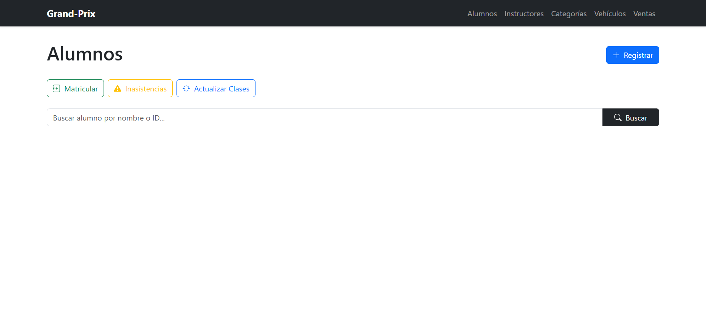

## Instructores

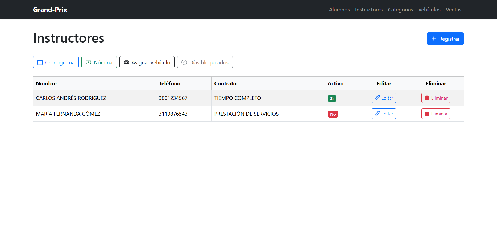

## Categorías

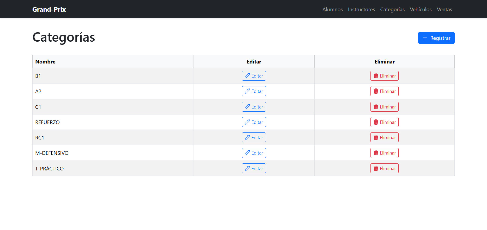

## Vehículos

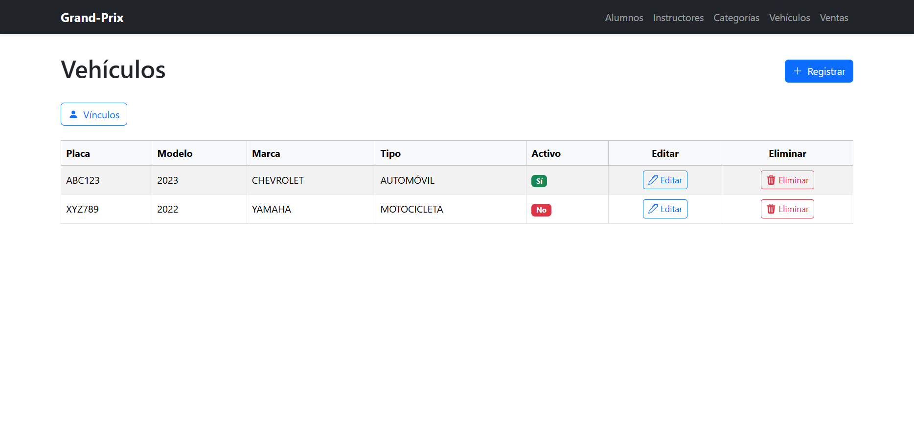

## Tipos de Clase

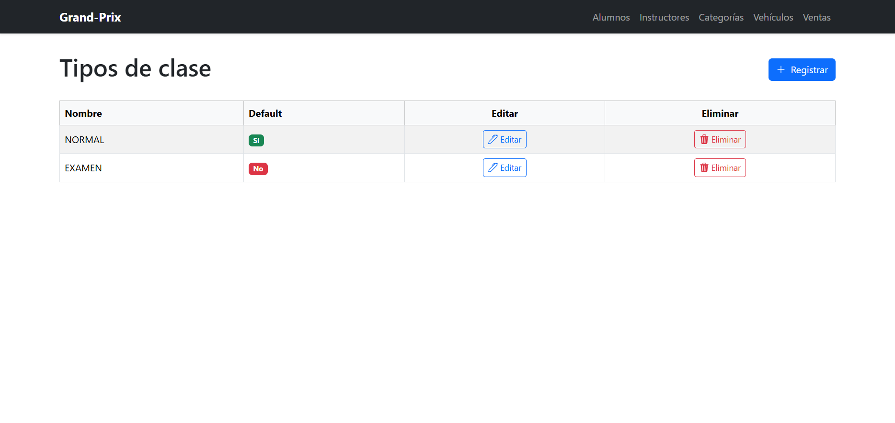

## Estados de Clase

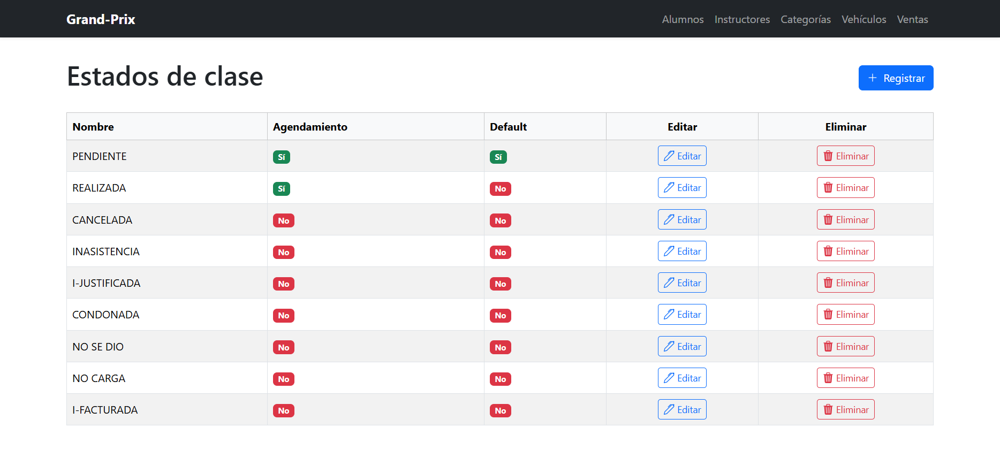

## Programación de Clases

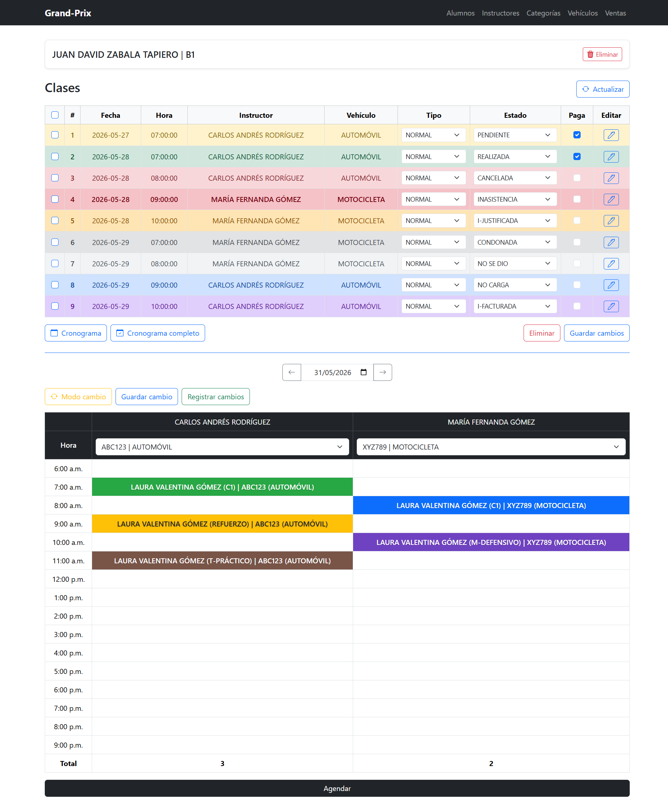

## Horario del Estudiante

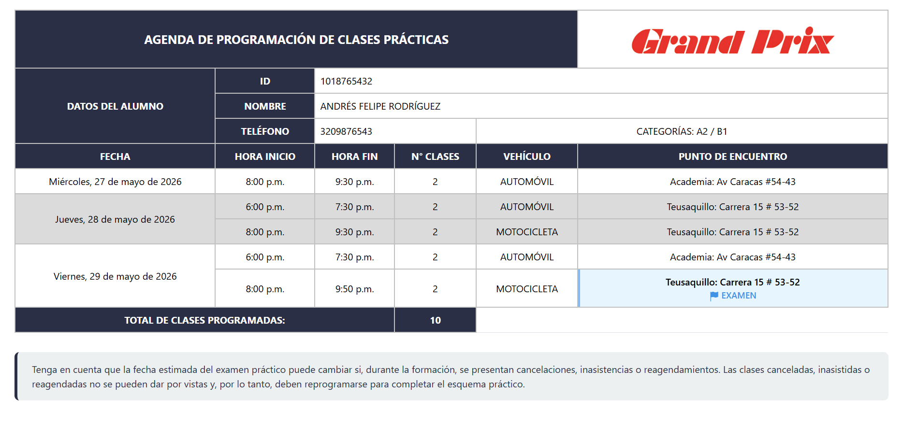

## Horario del Instructor

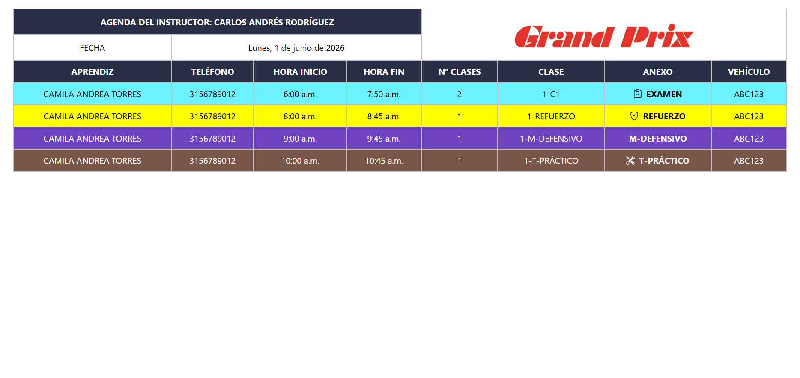

## Nómina

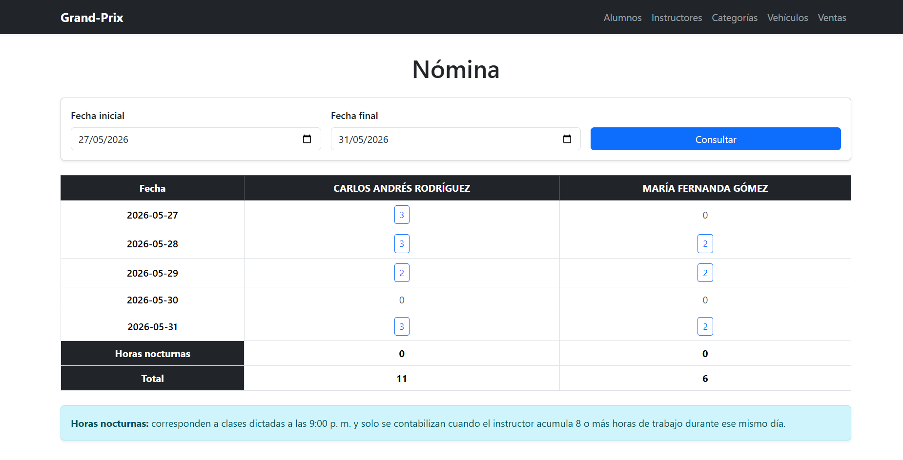

## Ventas

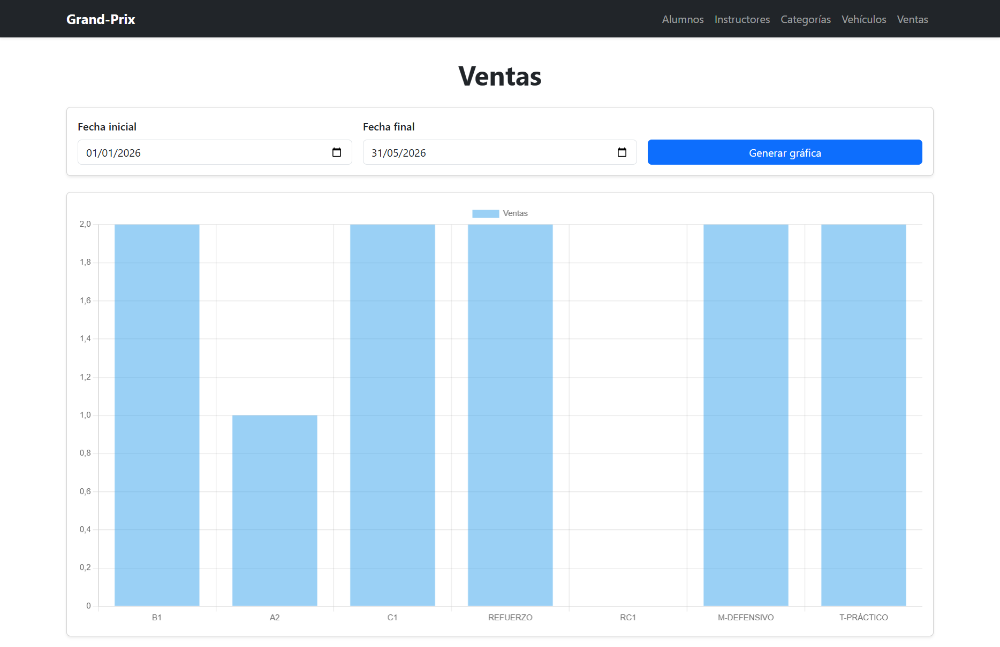

## Días Bloqueados

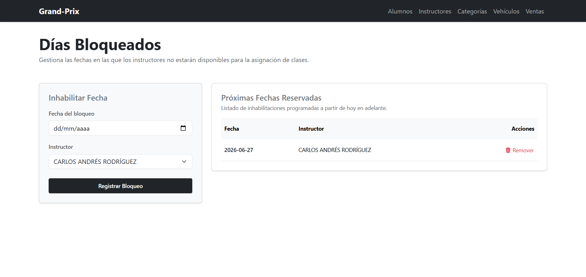

---

# 📚 Documentación

La documentación del proyecto está organizada por secciones:

- Backend
- Frontend
- Arquitectura
- Ejecución del proyecto

Consulta la carpeta:

```bash
docs/
```
